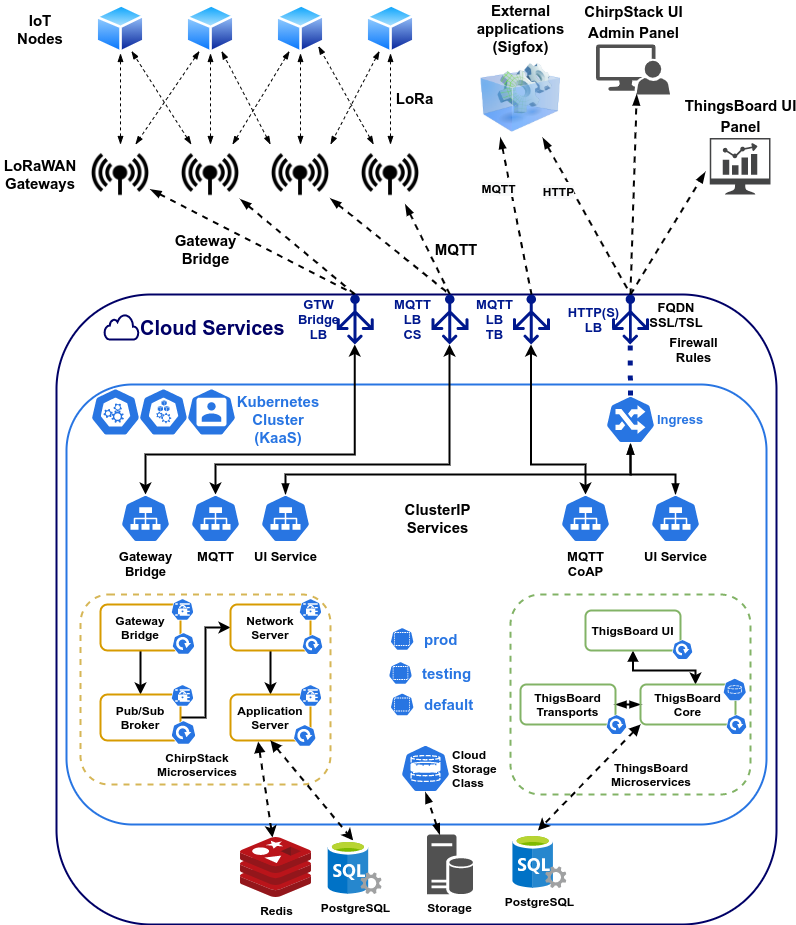

# ChirpStack and Thingsboard implementaion on Kubernetes

Implementation of a IoT Network in a Kubernetes cluster using ChirpStack (LoRaWAN) and ThingsBoard (IoT Device Management)

This project intended to be Cloud neutral but it's implemented on *Google Kubernetes Engine (GKE)*, hence some resources are *GKE* specific (e.g. Ingress)

## Project structure

In this project we used [ChirpStack](https://chirpstack.io) as a LoRaWAN server. For IoT device management we used [ThingsBoard](https://thingsboard.io).

The architecture of the project is shown in the following image



All cluster configuration was made using the declarative approach, so you can implement the entire cluster's services using the `kubectl apply` command.

```sh
$ kuebctl apply -f <resource-file>
```

## Namespaces

In this project we utilize 3 namespaces:
- **prod** in this namespaces will be placed the *production* configuration of the cluster, this namespace is configured with the **main** branch, in this namespace is configured the `Ingress` controller
- **testing** in this namespace you can make test of incoming changes, this namespaces is configured with **testing** branch
- **default** this is the default namespace, nothing is here

Use the following command to create the namespaces

```sh
$ kuebctl apply -f namespaces.yaml
```

## Databases

The database used in the project was `postgresql`. This database is managed by the cloud provider, this database needs to **enforce** the usage of `SSL`.

The entire configuration of database is in `database` directory, to apply the secret files concern to database configuration use the following command

```sh
$ find ./database -name '*yaml' -exec kubectl apply -f {} \;
```

## ChirpStack

ChirpStack utilizes several `microservices` each microservice needs a configuration file to run, this config file is written as a secret and mounted within the pod of microservice. The database certs files are mounted within the pod from a secret reference, these files are stored in `database/ssl/*/*.yaml`. Use the following command to create the `ChirpStack` architecture

```sh
$ find ./chirpstack -name '*yaml' -exec kubectl apply -f {} \;
```

## ThingsBoard

The architecture of `ThingsBoard` could be based on `microservices` or `monolithic`. In this stage we don't need the `microservice` architecture due to traffic, however this probably will change in the future on a fully functional network. So the `Thingsboard` project is executed using a single pod. Use the following command to create a single instance of `ThingsBoard`  

```sh
$ find ./thingsboard -name '*yaml' -exec kubectl apply -f {} \;
```

## Ingress

The ingress used here is based on `GKE`, the first thing to configure is a *static global ip* (see GKE documentation), this *static ip* will be used for the `ingress` controller. Use the following command to setup the `Ingress` controller

```sh
$ find ./ingress -name '*yaml' -exec kubectl apply -f {} \;
```  

## NodePort Services

At this stage of the project we don't need a `LoadBalancer` for every **non-http(s)** service due to the expensive cost, so to configure the **non-http(s)** services we utilize a `NodePort` Service for each one. In `GKE` you need to configure a firewall rule for each of `NodePort` service (see GKE documentation)

To access to `NodePort` service we configure a `dynamic DNS` on a `subdomain` in *Google Domains* this ip points to a single node within the cluster. To store the dynamic IP we use a `CronJob` that updates every 10 minutes. Use the following command to implement the dynamic IP update 

```sh
$ kubectl apply -f ddns-goole.yaml
```
## Logs

To see the logs of `ThingsBoard` use the following command
```sh
$ kubectl -n prod logs -f -l app=thingsboard
```

To see the logs of `ChirpStack Application Server` use the following command
```sh
$ kubectl -n prod logs -f -l app=cs-app-server
```

To see the logs of `ChirpStack Network Server` use the following command
```sh
$ kubectl -n prod logs -f -l app=cs-ntw-server
```
